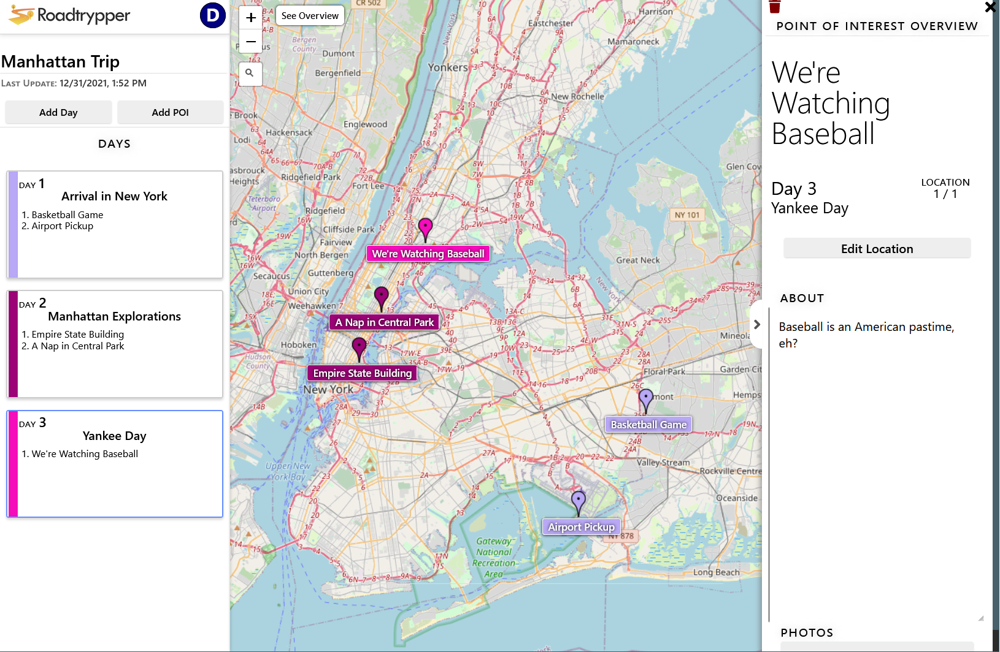

# RoadTrypper

**VISIT LIVE DEMO: https://roadtrypper.web.app/#/login**

## About

**RoadTrypper** is a web app built for the purpose of being a tool to record one's travels. Users can use this to to plan trips or journalize them if they've already happened.

### Inspiration
The COVID-19 pandemic has everybody cooped up at home. That feeling of wanderlust inevitably arises, as it had for me, and I found myself awfully nostalgic for past trips I've taken. Unsatisfied with what Google Maps offered, I set out to build my own travel journal application. By combining the spatial sense received from a map with a journalization system, I can record the details of my vacation to a much greater extent, allowing me to remember and relive them more vividly. 

***

## Features

### Robust Journalization
For each trip, the user can customize the days, points of interests they'll be visiting, and add photos onto each point of interest. Extensive editing controls allow the user to manage and place the points onto different days as needed.

### Live Map
The live map in the center of the app allows users to see which points belong to which day and as to where they are located. The points are displayed and categorized as the user creates them.

### Cloud Storage
Access Roadtrypper anywhere you go. All information is saved on the cloud and protected via user-authentication, courtesy of Google servers. The user can even log in with their Google account if they wish rather than sign up with their email.

***

## Technical Details
This project was built with:
- Front-end: React + Styled Components.
- Back-end: Google Firebase.

The following libraries were used:
- FontAwesome Icons
- Jest Testing Framework
- Leaflet OpenStreetMaps API
- Leaflet Control Geocoder with Nominatim.
- React Helmet

# Further Plans for RoadTrypper
- Use My Location feature for the map.
- Better responsive design for mobile devices.